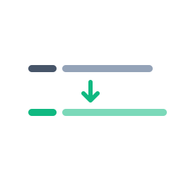

<p align="center">
  
</p>

<h1 align="center">engco</h1>

<p align="center">
  An async English coach that lives inside Claude Code.<br>
  Critiques every prompt with an inline diff. Translates non-English prompts to natural English.
</p>

---

## What it does

You write prompts to Claude in English to practice. engco watches every prompt, runs a Haiku call in parallel with Claude's response, and appends a coach footer at the end of the reply.

**English in:**

```
I sended this prompt to test the new sync mode and see if its faster
```

**Footer out (rendered after Claude's actual answer):**

```diff
- I sended this prompt to test the new sync mode and see if its faster
+ I sent this prompt to test the new sync mode and see if it's faster
```

**Changes:**
- `sended` → `sent` *(irregular past tense)*
- `its` → `it's` *(contraction)*

**Why:** "send" is irregular (send/sent/sent); "it's" = "it is" (not the possessive).

Korean (or any other language) in → translation mode:

```diff
- 이건 sync 모드 한국어 테스트야 잘 되는지 보자
+ This is a Korean language test for sync mode—let's see if it works.
```

## Why this design

A coach that interrupts your work fails the second time you use it. engco has to be invisible until you want it.

That means no spinner before Claude starts replying, no critique that lags one prompt behind what you just typed, and no separate panel or notification to check. The hook fires off a background worker (~1.2s API call) and tells the assistant: after answering the user, run this Bash command to fetch the result and paste it. Streaming the answer takes long enough that the worker is already done by the time the assistant calls Bash. The retrieval is instant. The coach footer appears at the end of the same response, matching the prompt that was just typed.

## Install

See [INSTALL.md](INSTALL.md). Two paths:

- **Plugin** (once published): `/plugin install engco@<marketplace>`
- **Manual**: `git clone … && bash install.sh`

Requires `ANTHROPIC_AUTH_TOKEN` or `ANTHROPIC_API_KEY` in env or `~/.claude/settings.json`.

## Slash commands

| Command | Effect |
|---|---|
| `/engco <text>` | Manual coach on the given text. Works on any input. |
| `/engco-on` | Enable the auto coach (default state). |
| `/engco-off` | Silence the auto coach. Manual `/engco` still works. |
| `/engco-show` | Pull the latest auto-coach result into chat. |

Plugin install namespaces these as `/engco:engco`, `/engco:engco-on`, etc.

## How it works

```
[user prompt]
     │
     ├─→ main agent ─▶ streams answer ─▶ runs Bash retrieval ─▶ pastes diff footer
     │
     └─→ engco_suggest.py (UserPromptSubmit, ~50ms)
              │
              └─→ engco_worker.py (detached, urllib API call ~1.2s)
                       │
                       └─→ writes ~/.claude/state/engco-last.md + pending.flag
```

The Bash one-liner the assistant runs at the end:

```bash
for i in $(seq 1 50); do [ -f ~/.claude/state/engco-pending.flag ] && break; sleep 0.1; done
[ -f ~/.claude/state/engco-pending.flag ] && \
  cat ~/.claude/state/engco-last.md && \
  rm -f ~/.claude/state/engco-pending.flag
```

If the response finishes before the worker (rare), the loop polls for up to 5s. If the worker fails entirely (network error, no credentials), the footer is silently dropped. The user's main flow never breaks.

## Configuration

| Variable | Where | Default |
|---|---|---|
| `ANTHROPIC_AUTH_TOKEN` | env or settings.json `env` block | required (or `ANTHROPIC_API_KEY`) |
| `ANTHROPIC_API_KEY` | env or settings.json `env` block | required (or `ANTHROPIC_AUTH_TOKEN`) |
| `ANTHROPIC_BASE_URL` | env or settings.json `env` block | `https://api.anthropic.com` |
| `MIN_WORDS` | top of `hooks/engco_suggest.py` | `6` |
| `MIN_CHARS` | top of `hooks/engco_suggest.py` | `20` |
| `MAX_PENDING_AGE_SEC` | top of `hooks/engco_suggest.py` | `600` (10 min) |
| `MODEL` | top of `hooks/engco_worker.py` | `claude-haiku-4-5-20251001` |

### Skip rules

The hook silently skips on:

- Empty prompt
- Prompt starting with `/` (slash commands)
- Prompt containing `[noeng]` (manual opt-out marker)
- Prompt containing triple backticks (code-heavy input; critiquing the framing adds noise)
- Prompt below both `MIN_WORDS=6` words AND `MIN_CHARS=20` characters
- Toggle off via `/engco-off` (creates `~/.claude/state/engco.off`)

### State files

| File | Purpose |
|---|---|
| `~/.claude/state/engco-last.md` | Most recent worker output. Read by `/engco-show`. |
| `~/.claude/state/engco-log.md` | Append-only history of every critique. |
| `~/.claude/state/engco-pending.flag` | Empty marker. Set by worker, consumed by retrieval. |
| `~/.claude/state/engco.off` | Toggle marker. Created by `/engco-off`, removed by `/engco-on`. |

## Customization

The system prompt that drives the coach lives at the top of `hooks/engco_worker.py`. Two modes:

- **Mode A (English)**: produces `📝 English coach` block with `Changes:` bullet list.
- **Mode B (non-English)**: produces `🌐 English coach (translation: <src> → en)` block with `Key renderings:` bullet list.

Linguistic labels used in change bullets: `article`, `collocation`, `register`, `run-on`, `redundancy`, `agreement`, `word order`, `tense`, `contraction`, `capitalization`, `typo`, `preposition`, `conjunction`, `plural`. Edit the prompt to add labels relevant to your target language pair.

To swap the model (faster, cheaper, slower-but-better), edit the `MODEL` constant.

To change which prompts trigger, edit `should_critique()` in `hooks/engco_suggest.py`.

## Acknowledgments

The defer-bash pattern (fire-and-forget hook plus assistant-pulled retrieval) came out of an iterative session. It works because Claude Code hooks run synchronously before the model speaks, but Bash tool calls happen during the model's response. The two phases let async work hide behind streaming.

## License

MIT. See [LICENSE](LICENSE).
